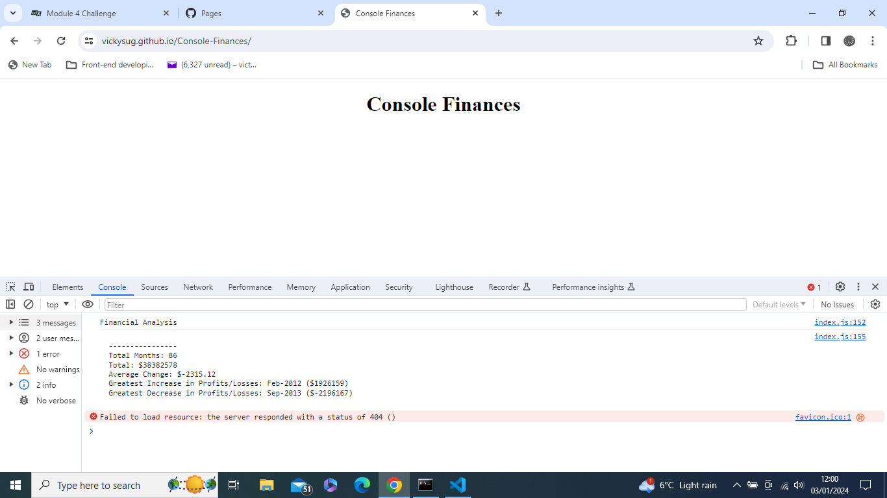

# Unit 4 Challenge: Console Finances

## Overview

In this challenge, I will be using the concepts I have learned to complete the required activity. This activity presents a real-world situation in which my newfound JavaScript skills will come in handy. I am tasked with creating code for analyzing the financial records of a company.I have been provided with a financial dataset in the `starter/index.js` file.

## I am going to:

1. Create a new GitHub repo called `Console-Finances`. Then, clone it to my computer.

2. Copy the starter files in my local git repository.

I have been given a dataset composed of arrays with two fields, Date and Profit/Losses.

My task is to write JavaScript code that analyzes the records to calculate each of the following:

* The total number of months included in the dataset.

* The net total amount of Profit/Losses over the entire period.

* The average of the **changes** in Profit/Losses over the entire period.
  * I will need to track what the total change in Profit/Losses are from month to month and then find the average.
  * (`Total/(Number of months - 1)`)

* The greatest increase in Profit/Losses (date and difference in the amounts) over the entire period.

* The greatest decrease in Profit/Losses (date and difference in the amounts) over the entire period.

When I open my code in the browser your resulting analysis should look similar to the following:

  ```text
  Financial Analysis 
  ----------------
  Total Months: 86
  Total: $38382578
  Average Change: -2315.12
  Greatest Increase in Profits/Losses: Feb-2012 ($1926159)
  Greatest Decrease in Profits/Losses: Sep-2013 ($-2196167)
  ```

My final code should print the analysis to the console.

**Hints:**

* I will need to do some research on your own for this project!

* Remember, in order to combine strings and variables in the console I will need to use **concatenation**.

* How do I only print to the nearest 100th in JavaScript?

## Screenshot of finished project and link to deployed application



https://vickysug.github.io/Console-Finances/
